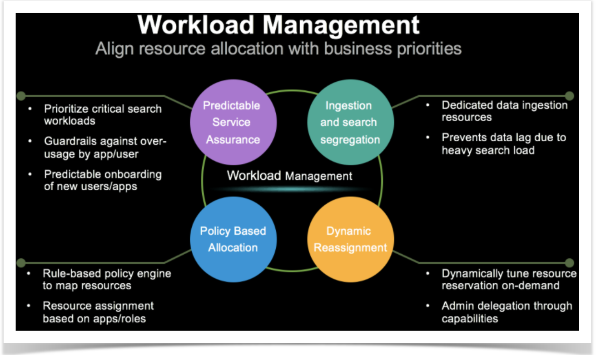
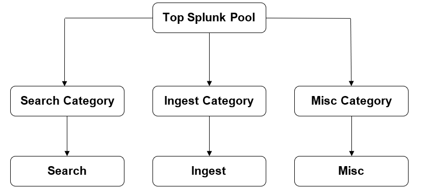
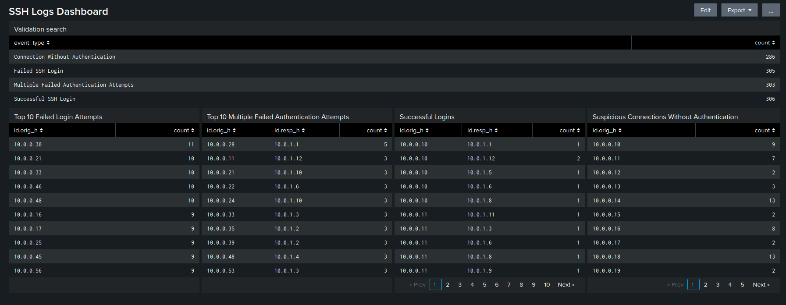

# 📊 Splunk Workload Management Implementation



## 📌 Overview

Workload management is a rule-based framework that lets you allocate compute and memory resources to search, indexing, and other processes in Splunk Enterprise.

With large numbers of searches running concurrently across your deployment, inefficient allocation of system resources can impact search execution, and cause latency, skipped searches, and other performance issues. In some cases, high-priority searches might not have adequate system resources, while trivial searches are allocated too much.

Workload management addresses these issues and helps you optimize resource usage by letting you control the amount of system resources allocated to searches and other processes in Splunk Enterprise.

---

## ⚙️ Key Features

- Prioritize resources for critical search workloads.
- Avoid data-ingestion latency due to heavy search load (When there is resource contention at Indexing Layer).
- Limit resource allocation to low-priority search workloads (such as real-time searches).
- Monitor searches and apply automated remediation (such as abort a search or throttle resources).
 

---

## 🧠 Best Practices

- Resource allocation should be done appropriately
  - Ingest category memory allocation → **100%**
  - Search + MISC memory allocation → **70-75%**
  - SH and IDX may have different resource allocation

- Don't overcrowd the high priority pool
  - Allocate majority of CPU resources **50-70%**
  - Place minority number of searches

- Think through mixed deployment well
  - Multiple SH scheduling searches on common IDX cluster

- Onboard a single use case at a time
  - Create rules, monitor impact, and then move forward
  - Workload rules have top down precedence, need to think through
  - Roles inheritance needs to be accounted

---

## ❗ What Workload Management is not?

- Not a feature that will suddenly increase your system throughput
  - Balancing resources to meet critical needs
  - Give to get
  - Better control

- Not able to directly manage I/O
  - Indirectly it influences through CPU throttling
  - Cannot be directly used to manage S2 cache

- Minimal impact when no resource contention

- Does not bypass quota controls and maximum concurrency
 

---

## 🖥️ Is Linux running systemd?

Use one of the following options to determine if your Linux distribution is running systemd. Run the systemctl command to check for a systemd version number.

```bash
$ systemctl --version
systemd 219
+PAM +AUDIT +SELINUX +IMA +APPARMOR +SMACK +SYSVINIT +UTMP +LIBCRYPTSETUP +GCRYPT +GNUTLS +ACL +XZ -LZ4 +SECCOMP +BLKID +ELFUTILS +KMOD -IDN Workload management supports systemd version 219 or later. See Requirements.
```
### Check systemd

Check for a systemd process ID. If the output shows PID=1, then you are running systemd. For example:

```bash
$ pidof systemd
1
```
---

## 🔧 Configure systemd to manage splunkd as a service

Configure systemd using enable boot-start

You can configure systemd to manage splunkd as a service using the enable boot-start command, as follows:
1.	Log into the machine on which you want to configure systemd to manage splunkd as a service.
2.	Stop splunkd.
```bash
$SPLUNK_HOME/bin/splunk stop
```
3.	If you previously enabled Splunk Enterprise to start at boot using the enable boot-start command, run disable boot-start to remove the splunk init script located in /etc/init.d and its symbolic links.
```bash
$SPLUNK_HOME/bin/splunk disable boot-start
```
4.	For instructions on how to reinstall the splunk init script, see Install splunk init script.
5.	Run the enable boot-start command, specifying the -systemd-managed and -user options, as follows:
```bash
$SPLUNK_HOME/bin/splunk enable boot-start -systemd-managed 1 -user <username>
```
6.	This installs the following systemd unit file, named Splunkd.service by default, in /etc/systemd/system. To specify a different unit file name, use the -systemd-unit-file-name option. See Specify the splunkd unit file name.

---

# 🚀 Implementation Phases

---

## 🔹 Phase 1: Enable Workload Management

### 📊 Resource Allocation Strategy



---

### ⚙️ Configure Workload Categories

Edit workload categories using Splunk Web

To edit the resource allocation for a workload category in Splunk Web, do the following:
1.	In Splunk Web, click Settings > Workload Management. The workload management UI opens.
2.	Click the All Categories tile.
3.	Click Edit under the specific category.
4.	Specify the resource allocation:

| Field | Action |
|----------|-----|
| CPU Weight | Specify the total CPU weight available for pools in this category. Unused CPU cycles are automatically shared with workloads in other categories. Link Below |
| Memory Limit %     | Specify the maximum percentage of Memory available for pools in this category.  |

5.	Submit

Note: The percentage of CPU allocated to a category is a ratio of the total CPU weight across all categories. When you change the CPU weight for one category the CPU allocated to all other categories and all workload pools update to reflect the change.

---

### 🧩 Configure Workload Pools

1.	In Splunk Web, click Settings > Workload Management.
2.	Click Add Workload Pool.
3.	Specify the following fields

| Field | Action |
|----------|-----|
| Pool Category | Select a workload category based on the type of process the pool will run (search, ingest, or misc). See Configure workload categories. |
| Name | Specify the name of the workload pool. Valid characters are alphanumeric and underscore only.  |
| CPU Weight | The fraction of total available CPU for this pool. Unused CPU cycles are automatically shared with workloads in other pools.  |
| Memory Limit % | The maximum percentage of total available memory for this pool.  |
| Default Pool | Toggle the switch to make this pool the default pool for the selected category.  |

4.	Click Submit.

The workload pool appears in the Workload Management UI.


---

### 🖥️ Configure workload management on an indexer cluster

To configure workload management on an indexer cluster, you must first configure and enable workload management on the search head, then use the configuration bundle method to push workload_pools.conf from the cluster master to peer nodes.

>You do not need to push workload_rules.conf to the indexer cluster. Its functionality applies to search heads only.

To configure and enable workload management on an indexer cluster:
1.	Configure and enable workload management on the search head. See Configure workload management.
2.	Copy the enabled workload_pools.conf file from the search head to the configuration bundle on the cluster master.
3.	Distribute the configuration bundle to all peer nodes. For detailed instructions, see Distribute the configuration bundle.

After the bundle push, peer nodes automatically reload the enabled configuration file, which enables workload management.

Ref: Configure WLM Link Below  

---

## 🔹 Phase 2: Splitting the pools and enabling Workload rules

### 🧠 Workload rules

A workload rule is a policy that you define to control access to workload pools. Each workload rule has a user-defined predicate (condition) that determines whether a search can access a designated pool. You can also specify an order for workload rules that determines which searches have priority access to a workload pool. 

---

### 🧩 Create workload rules
Workload rules provide a policy-based method for assigning searches to workload pools. Each rule specifies a predicate condition that must match before you can assign searches to the designated pool. You can use workload rules to ensure that high-priority searches have access to adequate resources while low-priority searches are restricted.

Workload rules are evaluated in the order that you create them. If the predicate condition defined in a rule does not match, the next rule in order is evaluated. If there is no match with any rule, the search is assigned to the default search pool. In this way, workload rules let you prioritize the assignment of system resources based on conditions that you define.

| Field | Action |
|----------|-----|
| Name | Specify the name of the workload rule. | 
| Predicate	| Specify a predicate condition to access the workload pool. The format is a logical expression where <type>=<value> with optional AND, OR, NOT, (). The valid <type> are "app", "role", "index", or "user". For example, "app=search AND role=power" maps all searches belonging to both the search app and the power role to the corresponding workload pool. For more information on predicates, see workload_rules.conf. |
| Workload Pool | Select the workload pool to which this rule applies. |

Search pool will further be split into the below set of workload pools & relevant resources allocated as per the diagram.
1.	high_perf_pool
2.	standard_perf_pool
3.	low_perf_pool

Below are some basic workload rules that I’d suggest to start off with.
1.	Any datamodel_acceleration & report_acceleration will default to low_perf_pool, role admin defaults to high_perf_pool
2.	Any user with only “user” role will default to low_perf_pool
3.	Any scheduled & adhoc will placed in standard_perf_pool
4.	If search_type=scheduled & runtime>3m move to low_perf_pool
5.	If search_type=adhoc & runtime>3m is greater than 5m abort the search

---

## 📊 Use Case Scenarios

---

### 🔹 Scenario 1: Prioritize Searches

Use cases:
1.	Provide a high priority resource pool for all searches run by the say for example admins.
2.	Put all index=* and all time range searches in a low priority pool.
3.	Abort all real-time searches after 1m.
4.	Move all long-running searches (>5m) that are not from the security team or admin into a low priority pool.
5.	Abort all long-running searches (>10m) that are not from the security team or admin.

To do this, follow the steps below:
1.	In Splunk Web, go to Settings > Workload Management.
2.	Click Add Workload Rule to create the following workload rule.

| Order	| Condition| Action |
|----------|-----|-----|
| 1	| NOT (role=security OR role=admin) AND runtime>10m	| Abort |
| 2 | NOT (role=security OR role=admin) AND runtime>5m | Move search to alternate pool: limited_perf |
| 3 | search_mode=realtime AND runtime>1m | Abort |
| 4 | index=* OR search_time_range=alltime | Place search in pool: limited_perf |
| 5	| role=security	| Place search in pool: high_perf |

---

### 🔹 Scenario 2: Create a high priority pool for scheduled searches

This scenario represents the following use case:
1.	Provide a high priority pool for all scheduled searches from users in role=privileged but move these searches to the standard pool if they run for more than 2m.
2.	Move all adhoc searches running for more than 5m to low priority pool.
3.	Put all index=* and all time range searches in a low priority pool.
4.	Abort all searches running for more than 15m except searches from the admin role.

To do this, follow the steps below:
1.	From Splunk Web, go to Settings > Workload Management.
2.	Create the following workload rules by clicking Add Workload Rule.

| Order	| Condition| Action |
|----------|-----|-----|
| 1 | NOT (role=admin) AND runtime>15m | Abort |
| 2	| search_type=adhoc AND runtime>5m | Move search to alternate pool: limited_perf |
| 3	| role=privileged AND search_type=scheduled AND runtime>2m | Move search to alternate pool: standard_perf |
| 4 | index=* OR search_time_range=alltime | Place search in pool: limited_perf |
| 5 | role=privileged AND search_type=scheduled | Place search in pool: high_perf |


---

### 🔹 Scenario 3: Create admission rules to pre filter searches

Use cases:
1.	Filter out a rogue search acting on all indexes or in the alltime time range.
2.	Filter out a rogue search acting on all indexes and in the alltime time range and not from the Enterprise Security app.
3.	Filter out an ad hoc search from a role (e.g. role=non_essential) during peak business days.

To do this, follow the steps below:
1.	In Splunk Web, click Settings > Workload Management.
2.	Click the Admission Rule tab.
3.	Create the following admission rules by clicking Add Admission Rule.

| Condition	| Action| Schedule |
|----------|-----|-----|
| index=* OR search_time_range=alltime | Filter search | always_on |
| index=* AND search_time_range=alltime | Filter search	| always_on |
| search_type=adhoc AND role=non_essential | Filter search | Every Week On Monday, Tuesday, Wednesday, Thursday, Friday |


---

## 🛠️ Sample Dashboard

---

## 🧪 Key Outcomes

- Improved search performance  
- Reduced indexing latency  
- Better resource utilization  
- Controlled rogue queries  
- Enhanced system stability  

---

## 🛠️ Tech Stack

- Splunk Enterprise  
- Linux (systemd)  
- Indexer Cluster  
- Search Head Cluster  

---

## 📚 References

- Splunk Workload Management Documentation

https://docs.splunk.com/Documentation/Splunk/8.2.4/Workloads/Configuredistributeddeployments

https://docs.splunk.com/Documentation/Splunk/8.2.4/Workloads/Configureworkloadmanagement